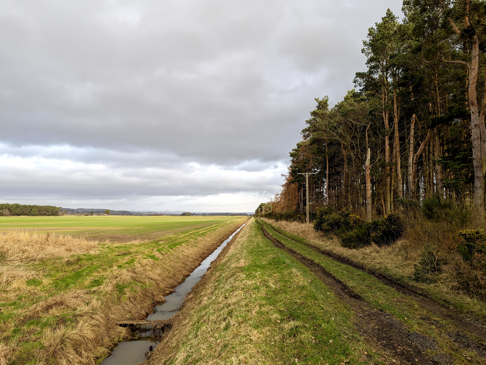

After almost two years of working behind the scenes, the website and consultation are finally open! We are now pleased we can take this proposal public and seek the views and ideas from local communities. We encourage everyone reading this to make sure they fill in the [survey](../survey.qmd) - it makes a massive difference!

## Why so long?
But why so long to get to this point? The answer to that is that there's already been a lot happening behind the scenes; for example, [exploring route options](the_story_so_far_2025.qmd), submitting our proposed cycle route on the [Council's Active Strategy](https://www.fife.gov.uk/__data/assets/file/0019/40078/active-travel-strategy-and-action-plan.pdf), contacting stakeholders, and particularly trying to engage landowners. Taking a look at the [map](../map.qmd) of possible routes, Option A is our preferred route, but it passes over land belonging to several landowners. Options B and C pass through more public land initially before hitting the back road to Leuchars. But, to meet any reasonable standards for cycle safety the road would need to be widened to incorporate a segregated cycle path.  This would of cut into existing fields and also take up productive farmland – we assess it would take more private land than our preferred route.

{.rounded-img}

## Land ownership issues
So all routes require the acquisition or use of some private land, and we wanted to get this right from the start by engaging with landowners, asking them what they thought and what issues there might be. We also wanted to be able to reflect landowner views to Fife Council on ways a path could be built that suited both the rural and wider community. Unfortunately, after a long series of talks, emails, and letters, and a delayed launch due to objections, we were unable to achieve a positive dialogue and in a few cases any dialogue at all.

The position of the landowners is that a path, particularly Option A along the old railway line, is incompatible with farming operations. Landowners argue that a path would:

- disrupt harvest by having cyclists on the path.

- disrupt pheasant shooting and stalking deer.

- prevent maintenance of ditches.

We have tried to propose potential solutions; for example, the path could be closed during harvest with diversions along the road or through Tentsmuir, and designing a path that allows for easy maintenance of ditches, but this has not resulted in any progress. 

A large portion of the old railway actually is already a core path that cyclists have a statutory right to use. In fact, it's a [relatively recent development that the full route between Tayport and Leuchars no longer exists](history-of-rights-of-way.qmd). We believe that there is a strong community, economic and environmental case for re-establishing a direct public right of way linking Tayport and Leuchars which is suitable and accessible for active travel. 

## What now
So where do we go from here?

Fife Council is generally very reluctant to progress cycle routes where there is little evidence of demand for use of the route or local community support.  This is for very good reason—it takes scarce staff and budget resource to develop detailed plans and constructing a cycle path costs a significant amount of money - £millions in some cases. So it's up to us as a community to make it known that we want this cycle path built. The council already believes this is a strategic route and has stated they would begin formal consultations when community support is demonstrated, taking into account views expressed by all sides. Hopefully, if we can demonstrate enough support, the landowners might also engage more constructively with finding a route that can work reasonably for all interests.

## Take the survey!
So in a nutshell, it's time to demonstrate that our local communities want this cycle link - connecting Dundee, Tayport, Leuchars, Guardbridge and St Andrews with an accessible, safe route for everyone. If you want this to happen then please take our [survey](../survey.qmd)! 
