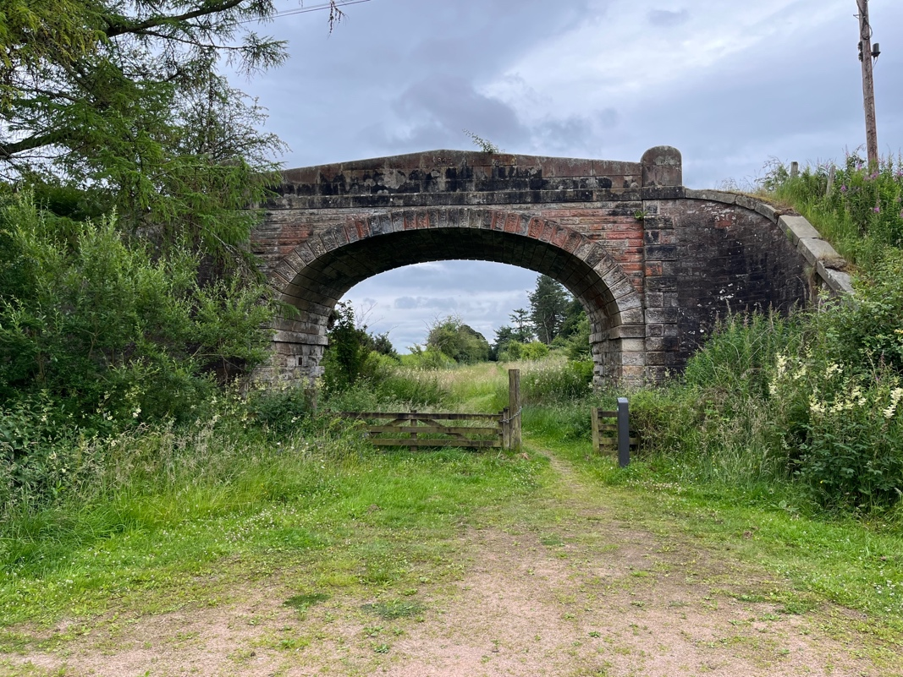
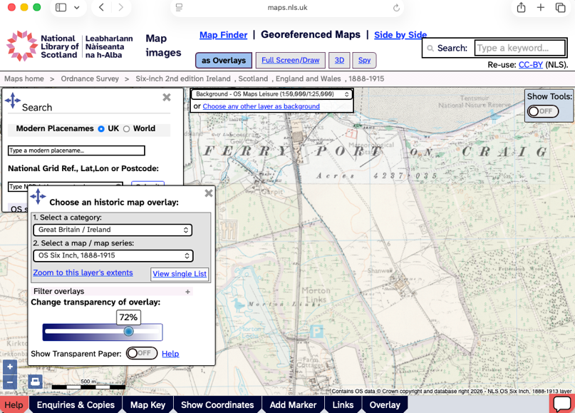
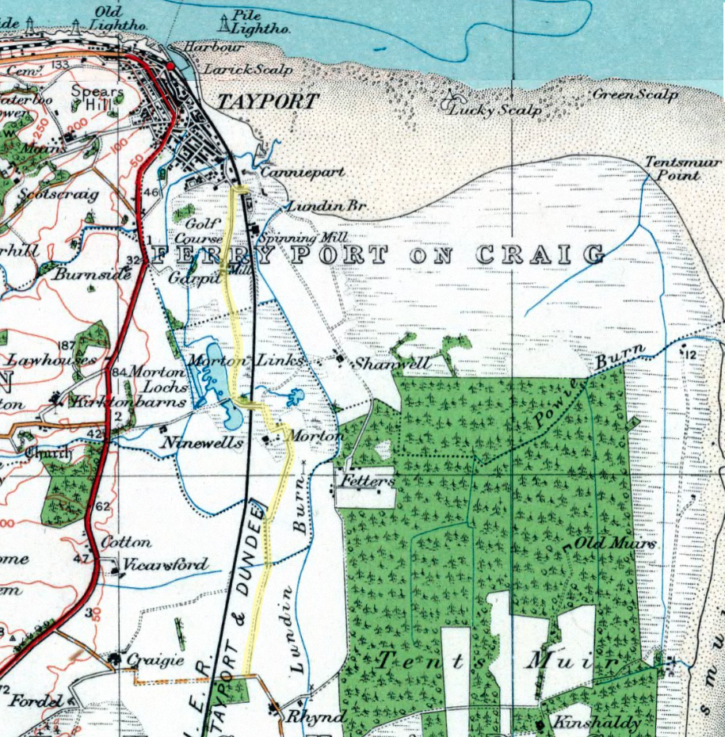
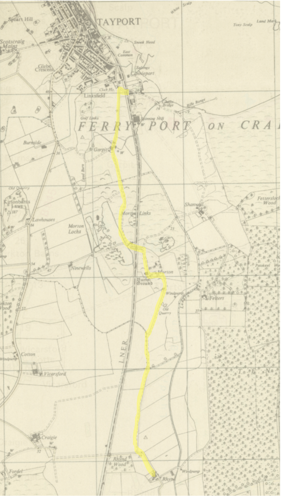

Anyone visiting Morton Lochs Nature Reserve can't help but notice the impressive arched bridge at the edge of the carpark. This puzzling bridge now spans a footpath to one of the bird hides, but 80 years ago, this was the road bridge across the railway line between Leuchars and Tayport. What was the railway line is now one of the main paths through Morton Lochs Nature Reserve.

{#fig-bridge width="70%"}

Curious about the closure of this train line, I asked a local archivist about it, and he pointed me to two fantastic resources.

## The National Library of Scotland Map Viewer

The first is the National Library of Scotland website, which allows you to compare historic and modern maps. Using the slider bar (at bottom left), you can slide between, for example, the 1888 Ordnance Survey (OS) map (at 100% transparency) and today's OS map (at 0% transparency), seeing how map features have shifted over the past century. You can zoom in and out and select other historic map overlays as options too!

{#fig-nls width="60%"}

Click here to access the [NLS site yourself](https://maps.nls.uk/geo/explore/#zoom=14.3&lat=56.43611&lon=-2.87848&layers=6&b=OSLeisure&o=62).

## The National Records of Scotland Archive

The second was the National Records of Scotland archive. This amazing [dataset](https://catalogue.nrscotland.gov.uk/nrsonlinecatalogue/overview.aspx?st=1&tc=y&tl=n&tn=n&tp=n&k=tayport&ko=a&r=&ro=s&df=1959&dt=1969&di=y) showed that the Records of Tayport Burgh, including all the council minutes, were held in the University of St Andrews. So I booked a session in the Napier Reading Room at the Martyrs Kirk Library to go and have a look at these. This beautiful old library on North Street and these old minutes transport you back in time! You can easily lose hours digging through these (chuckling at complaints about unattended dogs).

However, these also showed an investigation into rights of way around the Burgh and a report published by their Sub-Committee on Rights-of-Way. Discussed in the April 1967 minutes, this stated that one of the rights of way beyond the Tayport Burgh was from "Mill Bridge, Shanwell Road to Garpit and Morton Farm and from there to Rhynd Farm". Looking at the OS map (1:1m to 1:63K, 1920s-1940s), suggests that this route would have followed the yellow line shown:

{#fig-os-1920s width="90%"}

The OS 1:25,000 (Outline), 1945-1965 map shows the same:

This path is clear on maps as far back as 1798-1878, and 1885-1900. So it seems that this route following beside the old trainline was in fact a right-of-way extending back for more than a century. The current status quo, with no path south from Tayport to the Rhynd is quite a new development for this piece of land, and a path along the route of the old trainline would make a lot of sense to reinstate this lost right-of-way.

## Links

- [Ferry, Harbour & Railway - Board 1 - Tayport Heritage Trail](https://tayportheritage.com/trail-guide/board-1/)
